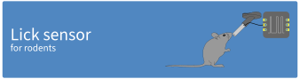

# Lick sensor for rodents

A device for measuring licking behaviour in rodents in real time.

This project describes a lick sensor developed for the purpose of
measuring licking behaviour in laboratory animals. Licking behaviour,
and in particular the analysis of lick microstructure, is a useful tool
for studying ingestive behaviour, motivation, and food preference.

2021-2025 Antonio González

## Features

The lick sensor is built with a Raspberry Pi Pico microcontroller board
and a capacitive touch sensor. It can can be used with standard water
bottles for rodents, and does not require modifications to animal home
cages. The lick sensor can thus be adapted to a wide range of
experimental setups.

Licks are detected in real time with millisecond precision from one or
many drink bottles simultaneously. The data can be recorded using any
standard data acquisition system; it can be sent to a computer for
storage; and/or it can be used for real-time control of additional
laboratory hardware such as LEDs for optogenetics.

### Variants

Different variants of the lick sensor are possible, depending on the
number of drink bottles required, and also on whether lick data is to be
recorded "raw" (i.e. as a continuous vector of on/off, digital data
samples), or saved in the form of lick events (timestamps).

Details of each of these options can be found in the relevant
directories. Briefly,

* [**One bottle, one BNC output**](bottle-x1-bnc-out). This is the
  simplest lick sensor variant: it uses only one drink bottle. Licks
  from this bottle are detected and directed to a BNC connector from
  where they can be recorded with a data acquisition system and/or used
  for driving additional laboratory hardware in real time.

* [**Several bottles, BNC outputs**](bottle-x6-bnc-out). Similar to the
  setup above but using more than one drink bottle.

* [**Many bottles (up to 12), USB output**](bottle-x12-usb-out). Here,
  lick events (timestamps) from many drink bottles are detected and sent
  to a computer connected to the microcontroller with a USB cable. The
  construction of this lick sensor is very simple and a data-acquisition
  system is not required. On the other hand, the software side of it is
  more elaborate: it is necessary to install and run Python software in
  the host computer.

* [**Many bottles (up to 24), USB output**](bottle-x24-usb-out). As
  above, but using 2 touch-detection boards to handle up to 24 drink
  bottles simultaneously.

## Requirements

### Lick sensor hardware

* Drinking bottle(s). Any standard drinking bottle for rodents should
  work. We use the Crystal Deluxe Mini Bottle 75 ml ([Classic Pet
  Products, UK, cat. num.
  0190](https://classicpetproducts.co.uk/product/crystal-deluxe-mini-bottle-75ml/))
  obtained from a local pet shop.
* [Raspberry Pi
  Pico](https://www.raspberrypi.com/products/raspberry-pi-pico)
  microcontroller board.
* Capacitive touch sensor module. We use [Adafruit product ID
  1982](https://www.adafruit.com/product/1982); up to 12 water bottles
  can be connected to one of these modules[^1]. Other manufacturers sell
  touch sensors based on the MPR121 and any of these should work equally
  well.
* Stranded-core cable (e.g. 24 AWG or 26 AWG standard hook-up cable).
* A USB cable for the Raspberry Pi Pico.
* BNC connector(s). Optional, depending on the sensor variant chosen.

Some means to put the components together, for example:

* Perforated board or stripboard.
* Jumper wires.
* Soldering tools.

Supplier information and ordering codes are listed in
[material.md](docs/material.md).

### Lick sensor software

* C development tools and the knowledge/ability to build a project for
  the Raspberry Pi Pico, as described in the [Pico
  documentation](https://datasheets.raspberrypi.com/pico/getting-started-with-pico.pdf).
* MPR121 library for the Raspberry Pi Pico, available at
  https://github.com/antgon/pico-mpr121.

### Data acquisition hardware

Depending on the variant chosen, you will need either:

* A standard laboratory data-acquisition system. This is only needed
  if you want to record *raw* data (e.g.
  [bottle-x1-bnc-out](bottle-x1-bnc-out)), or
* A computer to record lick events. We use a Raspberry Pi 4 computer
  with very good results. See [bottles-x12-usb-out](bottles-x12-usb-out)
  for details.

[^1]: Adafruit sell two different MPR121 touch sensor breakouts under
    the same Product ID 1982: the original, header-only version, and the
    STEMMA QT version. Both work in the same way, and the PCBs are the
    same size (and look similar). Be aware, however, that **the pins are
    in a different order**.
