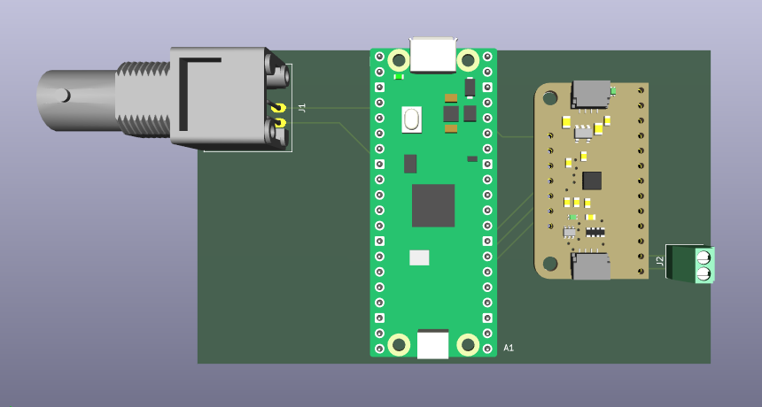

# Lick sensor: one bottle, BNC output

Lick sensor for one drinking bottle, with continuous raw output stream.

## Description

This version of the lick sensor is simple to build and operate.

Lick data from the sensor is sent to the BNC connector as a stream of
digital values. A data acquisition board can be connected to this BNC in
order to capture licking data.

Alternatively, the output from the BNC connector can be used to control
some additional piece of laboratory hardware. For example, an LED for
optogenetics connected to the lick sensor in this manner would be
switched on or off according to licks. 

## Material

The components can be mounted and connected using a stripboard. Other
than that, all is needed is

* BNC connector
* Raspberry Pi Pico
* Touch sensor breakout board MPR121
* Terminal block (02x01) or similar

Detailed wiring diagrams are in the folder [pcb](pcb).

## Programming and operation

* Compile `lick_gpio_single.c` and flash into the Pico.
* Connect the spout of a drinking bottle to the terminal block. If only
  one cable is used (i.e. signal only, no ground) make sure to connect
  this to the side of the terminal block that is in turn connected to
  the input `0` in the touch sensor breakout board.
* Power up the Pico (e.g. using a USB cable).
* Connect data acquisition board and/or additional hardware to the BNC
  connector.
