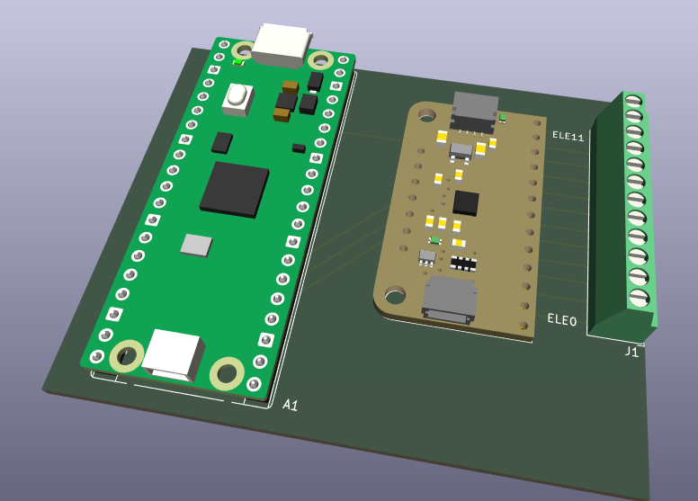

# Lick sensor: up to 12 bottles, detect lick events

This variant of the sensor detects licks from up to 12 drink bottles
simultaneously. Lick events (timestamps) are sent to a host computer
connected to the Raspberry Pi Pico via a USB cable.

## Wiring and operation

Wiring of the components is simple and a stripboard can be used to
facilitate this; see folder [pcb](pcb).

For logging the data, a host computer connected to the lick sensor must
read and save the data received. We use for that a Raspberry Pi 4 (or 5)
computer:

* Compile `lick_events_usb.c` and flash into the Pico.
* Save the provided Python script (`lick_events_reader.py`) to the host
  computer.
* Connect the drink bottles to the lick sensor.
* Connect the Pico to the host computer.
* Boot the host computer. Open a terminal and run the Python script
  above. Lick data will be logged to a local text file. To stop, press
  Ctrl+C.
* To convert the data in the text file to a more readable form suitable
  for analysis, run the Python script
  [`events-to-long.py`](../utils/events-to-long.py).
