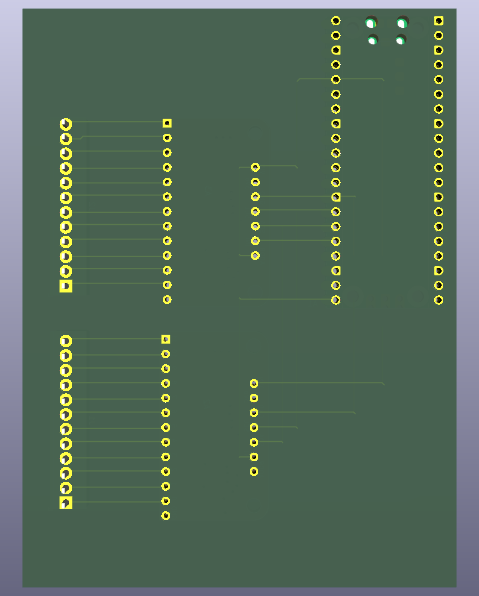
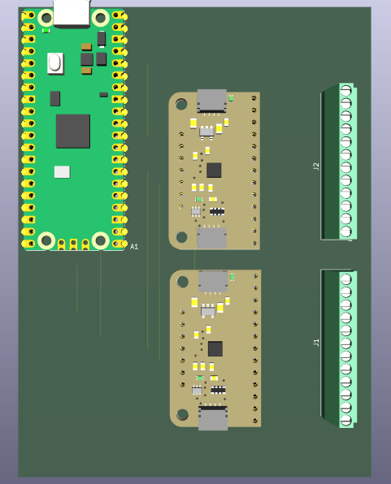

# Lick sensor: up to 24 bottles, log lick events

This variant of the sensor detects licks from up to 24 drink bottles
simultaneously. A host computer connected to the sensor logs lick events
(timestamps).

The principles are the same as in the [12-bottle
variant](../bottle-x12-usb-out/) but this variant requires 2
touch-sensing breakout boards.

## Wiring and operation

All components fit on a 100x75 stripboard. The figures below illustrate
how these components can be connected taking advantage of the copper
strips on the board (horizontal) and jumper wires (vertical); see
diagrams in the folder [pcb](pcb).

| Back| Front|
|:-:|:-:|

For logging the data, a host computer connected to the lick sensor must
read and save the data received. We use for that a Raspberry Pi 4 (or 5)
computer:

* Compile [`lick_two_sensors.c`](lick_two_sensors.c) and flash into the
  Pico.
* Save the Python script
  [`lick_events_reader.py`](`lick_events_reader.py`) to the host
  computer.
* Connect the drink bottles to the lick sensor.
* Connect the Pico to the host computer.
* Boot the host computer. Open a terminal and run the Python script
  above. Lick data will be logged to a local text (csv) file. To stop,
  press Ctrl+C.

## Data post-processing

By default, the data sent by the Pico to the computer is saved as a text
(csv) file consisting of the timestamp of the lick event(s) followed by
a single number for each of the 2 touch sensors. That number is the
binary representation of the status of the sensor's electrodes; thus,
for example, if licks were detected by electrodes 0 and 4 in sensor A,
the number logged for that sensor will be 17 (0b000_0001_0001).

To extract the values for each electrode from that data file for further
analysis, the csv file can be further processed off-line with the script
[`events-to-long.py`](../utils/events-to-long.py).
