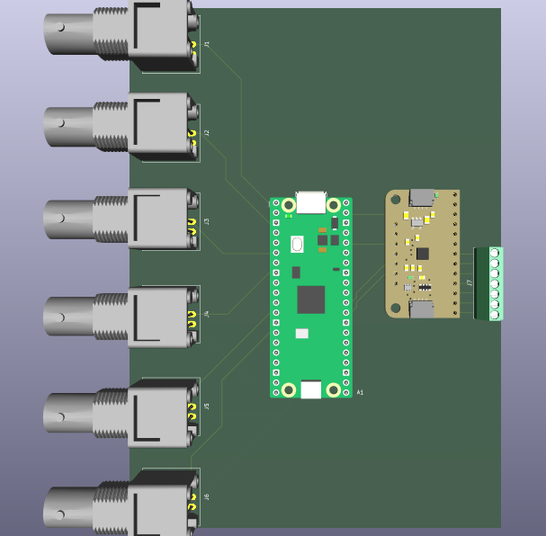

# Lick sensor: several bottles, BNC outputs

Lick sensor for more than one drinking bottle, with continuous raw
output stream.

## Description

This is an extension of the lick sensor used for only one bottle
([bottle-x1-bnc-out](../bottle-x1-bnc-out)), and programming and
operation is thus similar as described there.

Wiring details are in the folder [pcb](pcb).
