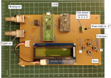

# Lick sensor prototype

This prototype was designed for testing the lick sensor while observing
the effects of changing the sensor's settings: an LCD and four push
buttons allow to change the settings of the MPR121 capacitive sensor on
the fly. This helps tune the sensor and evaluate its ability to detect
licks under varying circumstances.

There are two BNC connectors: one outputs the digital signal, i.e. 0s
and 1s, with 1s indicating licks. The other outputs the analog signal
from the capacitive sensor, which helps visualise the changes in
capacitance that occur with licking. With these two outputs connected to
a data acquisition board, the behaviour of the touch sensor can be
assessed.

## Building and operation

1. This prototype is designed to be built on a perforated board. Details
   can be found in the [pcb](pcb) folder.

2. Program the microcontroller: compile `app/main.c` and flash into the
   Raspberry Pi Pico. See the [Pico
   documentation](https://www.raspberrypi.com/documentation/microcontrollers/pico-series.html#documentation)
   for details of how to do this. Note that in addition to standard Pico
   libraries, these 3 libraries are required:
    * [lcd16x2_i2c.h](https://github.com/antgon/pico-lcd16x2_i2c)
    * [mcp48x1.h](https://github.com/antgon/pico-mcp48x1)
    * [mpr121.h](https://github.com/antgon/pico-mpr121)

3. Connect a drink bottle to the board. Connect the two BNC outputs to a
   data acquisition (DAQ) board. Power up the Raspberry Pi Pico. The
   lick sensor will output data to the BNCs every 20 ms (50 Hz).

4. Modify the MCP121 settings using the buttons (see [docs](docs)
   for detailed instructions), use the DAQ to observe the effects of
   doing this.
